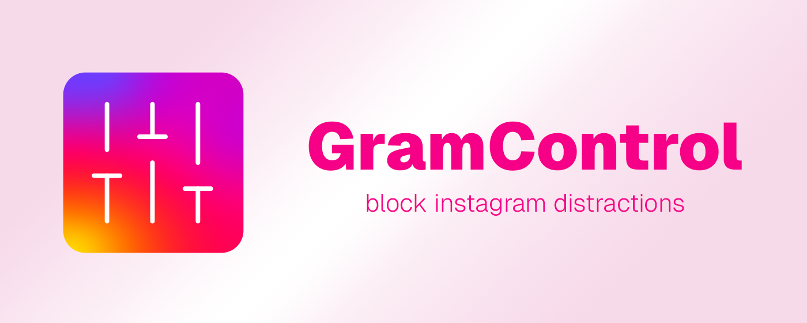

# GramControl – Block Instagram Distractions




GramControl removes the unnecessary distractions of Instagram and lets you, once again, enjoy connecting with your friends and community.

Currently we support the following customizable options with more to come:

- Hides Instagram Explore and Reels links
- Hides suggested posts and recommendations from your feed
- Hides comments from posts
- Hides suggested friends sections

GramControl is open-source, lightweight, reliable, and intuitive. It never saves, sends, or uses any of your information for purposes other than its core functionality.

## Install Locally (Chrome)

1. Download the latest .zip file version from [https://github.com/Thinkorswim/gram-control/releases](https://github.com/Thinkorswim/gram-control/releases)
2. Unzip the file and you should have a folder `gramcontrol-chrome`
3. Move the folder to a permanent location on your computer (do not delete the folder after installation).
4. Go to the extensions page: chrome://extensions
5. Enable Developer Mode (toggle "Developer mode" at the top-right corner)
6. Click Load unpacked and select/open the extension folder (contains file manifest.json).


## Developer setup

The project is based on the [WXT Framework](https://wxt.dev/) with Vite and React. To start development or build from source follow the steps below:

1. Download and install Node.js from the [official website](https://nodejs.org/).
2. Clone the repository 

```
git clone https://github.com/Thinkorswim/gram-control.git
``` 

3. Install dependencies 

```
cd gram-control/GramControl
npm install
```

4. Run the project

```
npm run dev
```

5. (Optional) Create a build from source

```
npm run build
```

This creates a `dist` folder which can be loaded unpacked into your browser extensions. Hot reloading development is available.
